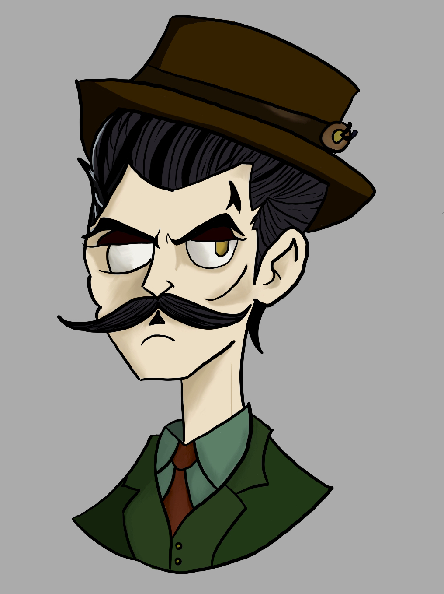
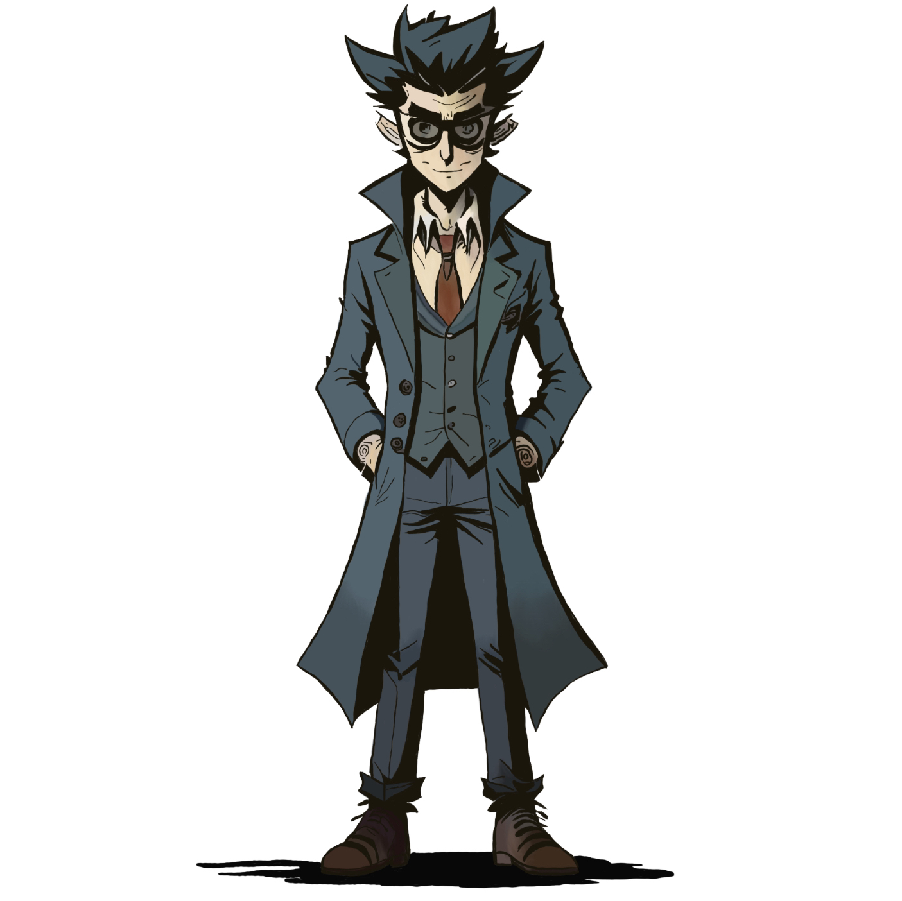
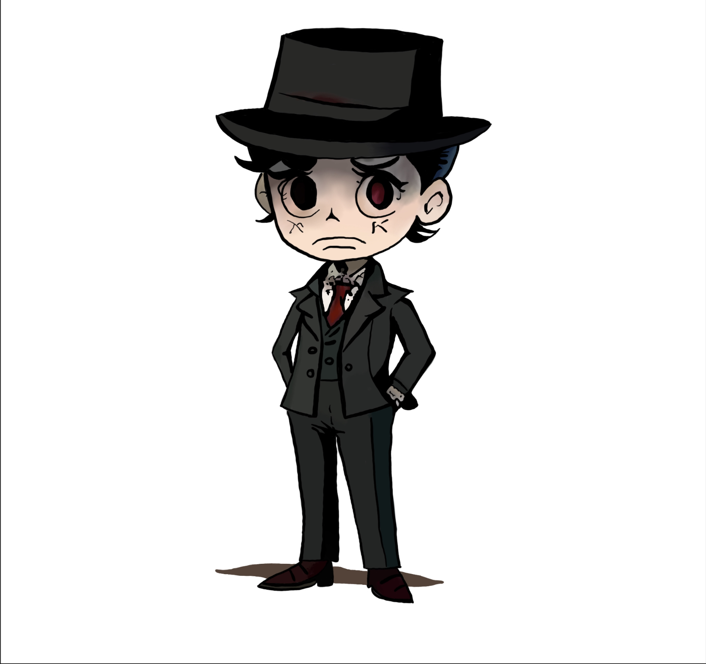
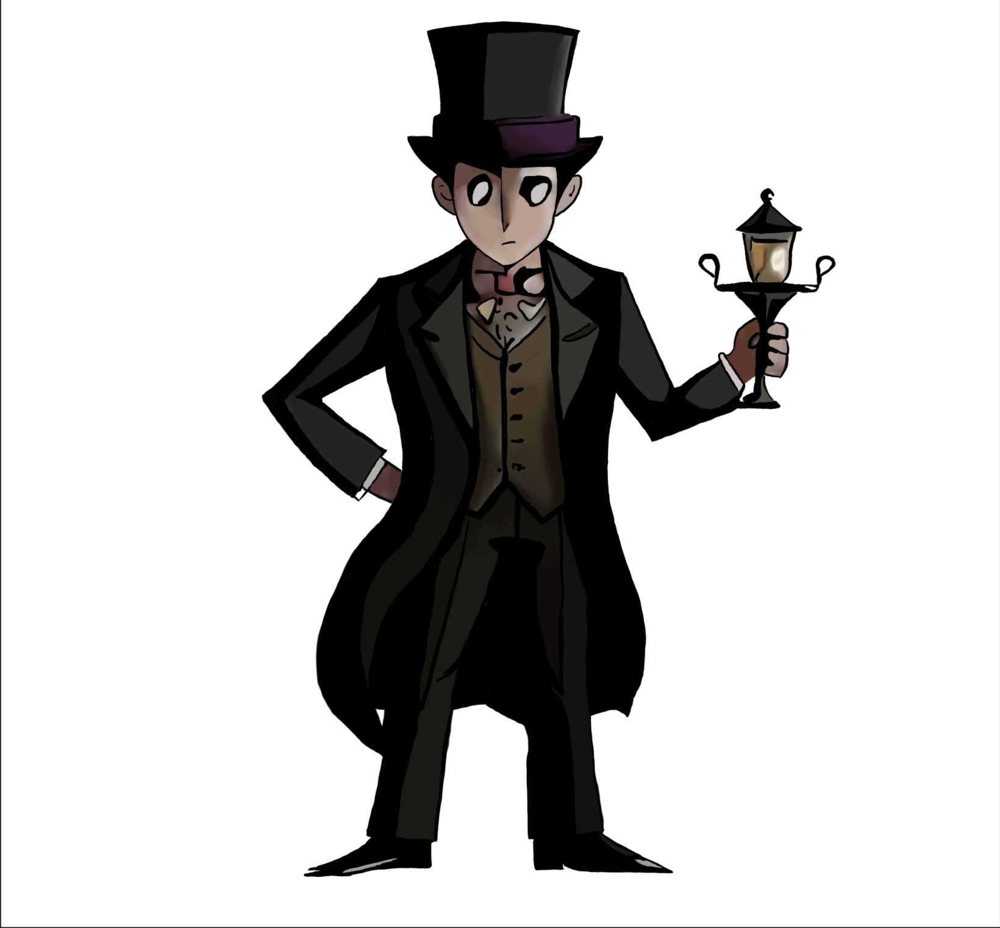

# Monstrous Tide *nie finałowa, może się zmienić*

---

---

## Opis świata Gry

- Londyn, wiek XIX
- Motywy Lovecraftowe
- Brak głębokiego lore'u ani dużo NPC
    - Ewentualnie environmental storytelling

---

## Główny Bohater

Detektyw prowadzący śledztwo w sprawie porwanej córki bogacza

---

## Grafiki koncepcyjne

---

## Gatunek oraz Styl

- **Gatunek** - rougelike, shoot 'em up
- **Rodzaj Grafiki** - "wycinkowa", coś podobnego do [Don't Starve](https://external-content.duckduckgo.com/iu/?u=http%3A%2F%2Fwww.macgamestore.com%2Fimages_screenshots%2Fdont-starve-16450.jpg&f=1&nofb=1&ipt=a2870a1203baac38ff569837f2637443e84feef40986363b71637205018c91e4&ipo=images) albo [Cult of the Lamb](https://external-content.duckduckgo.com/iu/?u=https%3A%2F%2Fwww.ggrecon.com%2Fmedia%2Fecha5add%2Fcult-of-the-lamb-multiplayer.jpg&f=1&nofb=1&ipt=3106543dda23facd1cfcd651ff9b51d695ba8cd2c2214bb592e58791f0455e05&ipo=images) bez słodkości
- **Widok** - Z góry (top-down)

---

## Mechanika wyróżniająca grę

 - Różne ścieżki rozwoju broni wpływające na rozgrywkę i zakończenie 
    - np. bicz, który przy demonicznej ścieżce zamienia się w mackę

---

## Używane Technologie

- **Silnik**: Godot 4
- **Edytor Graficzny:** niesprecyzowany

---

## Marketing oraz Monetyzacja

- **Grupa Docelowa** - 15+
- **Monetyzacja** - **na razie** brak

---

# [--> Pełna Dokumentacja <--](/GDD/GDD.md)
